# ThinkSecure - System Development Methodology Diagram

## Visual Workflow

```mermaid
graph LR
    A[📊 Phase 01<br/>Requirement Analysis<br/>Define system goals<br/>and user needs] --> B[💾 Phase 02<br/>Data Handling<br/>Collect and preprocess<br/>application data]
    
    B --> C[🏗️ Phase 03<br/>Modeling & Architecture<br/>Design system architecture<br/>and components]
    
    C --> D[⚙️ Phase 04<br/>System Development<br/>Build web app, database,<br/>and security features]
    
    D --> E[🚀 Phase 05<br/>Deployment & Testing<br/>Deploy system and<br/>validate performance]
    
    E --> F[📦 Phase 06<br/>Documentation & Delivery<br/>Prepare documentation<br/>and deliver system]
    
    F --> G[✅ Production Ready]
    
    style A fill:#4ade80,stroke:#22c55e,stroke-width:3px,color:#000
    style B fill:#60a5fa,stroke:#3b82f6,stroke-width:3px,color:#000
    style C fill:#f59e0b,stroke:#d97706,stroke-width:3px,color:#000
    style D fill:#ec4899,stroke:#db2777,stroke-width:3px,color:#fff
    style E fill:#8b5cf6,stroke:#7c3aed,stroke-width:3px,color:#fff
    style F fill:#14b8a6,stroke:#0d9488,stroke-width:3px,color:#000
    style G fill:#10b981,stroke:#059669,stroke-width:4px,color:#fff
```

---

## Detailed Phase Breakdown

### 🎯 Phase 01: Requirement Analysis
**Icon:** 📊 Analysis Chart  
**Color:** Green  
**Activities:**
- Define system goals and user needs
- Identify target audience (Students & cybersecurity enthusiasts)
- Document feature requirements
- Select technology stack

**Deliverables:**
- Feature requirements document
- User stories & use cases
- Technology stack selection
- Security requirements specification

---

### 💾 Phase 02: Data Handling
**Icon:** 💾 Database  
**Color:** Blue  
**Activities:**
- Design data models (User, Leaderboard)
- Establish MongoDB schema
- Implement data validation
- Create migration scripts

**Technologies Used:**
- MongoDB (NoSQL database)
- Mongoose ODM
- bcrypt (password hashing)
- JWT (authentication tokens)

---

### 🏗️ Phase 03: Modeling & Architecture
**Icon:** 🏗️ Building  
**Color:** Orange  
**Activities:**
- Design three-tier architecture
- Define API endpoints (RESTful)
- Establish design patterns (MVC, Repository, Middleware)
- Plan component relationships

**Architecture Pattern:**
- **Presentation Layer:** React Frontend (Port 5173)
- **Application Layer:** Node.js/Express Backend (Port 5000)
- **Data Layer:** MongoDB Database

---

### ⚙️ Phase 04: System Development
**Icon:** ⚙️ Gear  
**Color:** Pink  
**Activities:**
- Build React frontend (25+ components)
- Develop Express backend (10+ API routes)
- Implement authentication system (JWT + OAuth)
- Create 9 cybersecurity challenges

**Key Components:**
- AuthModal, ProtectedRoute, AuthCallback
- PasswordChallenge, SecurityQuiz, WebCTF
- StegoCTF, ForensicsCTF, OSINTCTF
- HackTheHacker, AttackSimulator, CyberEscapeRoom
- Leaderboard with certificate generation

---

### 🚀 Phase 05: Deployment & Testing
**Icon:** 🚀 Rocket  
**Color:** Purple  
**Activities:**
- Deploy to Render.com (Frontend + Backend)
- Configure MongoDB Atlas
- Set up environment variables
- Run comprehensive testing (Unit, Integration, UAT)

**Deployment Platforms:**
- Frontend: Render Static Site
- Backend: Render Web Service
- Database: MongoDB Atlas

**Testing Types:**
1. Unit Testing
2. Integration Testing
3. User Acceptance Testing
4. Responsive Testing
5. Security Testing

---

### 📦 Phase 06: Documentation & Delivery
**Icon:** 📦 Package  
**Color:** Teal  
**Activities:**
- Create comprehensive documentation (10+ files)
- Write deployment scripts (.bat, .ps1)
- Prepare final deliverables
- Set up automated CI/CD pipeline

**Documentation Created:**
- README.md
- PROJECT_SUMMARY.md
- QUICK_START.md
- DEPLOYMENT_CHECKLIST.md
- ENV_VARIABLES_QUICK_REF.md
- GOOGLE_OAUTH_SETUP.md
- And 5 more...

---

## 🔄 Continuous Integration & Deployment

```mermaid
graph TD
    START[👨‍💻 Developer<br/>Makes Changes] --> |git commit| COMMIT[📝 Commit to<br/>GitHub Main]
    COMMIT --> |Auto-trigger| BUILD[🔨 Build Process<br/>Vite Build]
    BUILD --> |Success| DEPLOY_FE[🌐 Deploy Frontend<br/>Render Static Site]
    BUILD --> |Success| DEPLOY_BE[⚙️ Deploy Backend<br/>Render Web Service]
    DEPLOY_FE --> |Live| PROD[✅ Production<br/>Environment]
    DEPLOY_BE --> |Live| PROD
    PROD --> |Monitor| FEEDBACK[📊 User Feedback &<br/>Bug Reports]
    FEEDBACK --> |Iterate| START
    
    style START fill:#60a5fa,stroke:#3b82f6,stroke-width:2px,color:#000
    style COMMIT fill:#8b5cf6,stroke:#7c3aed,stroke-width:2px,color:#fff
    style BUILD fill:#f59e0b,stroke:#d97706,stroke-width:2px,color:#000
    style DEPLOY_FE fill:#ec4899,stroke:#db2777,stroke-width:2px,color:#fff
    style DEPLOY_BE fill:#ec4899,stroke:#db2777,stroke-width:2px,color:#fff
    style PROD fill:#10b981,stroke:#059669,stroke-width:3px,color:#fff
    style FEEDBACK fill:#14b8a6,stroke:#0d9488,stroke-width:2px,color:#000
```

---

## 📊 Technology Stack Overview

---

## 🎯 Feature Implementation Timeline

---

## 🏆 Key Achievements

### ✅ Completed Features
- [x] User Authentication (Email/Password + Google OAuth)
- [x] 9 Cybersecurity Challenges
- [x] Real-time Leaderboard with Podium Display
- [x] Certificate Generation (Gold/Silver/Bronze)
- [x] Responsive Design (Mobile/Tablet/Desktop)
- [x] Password Reset with Email
- [x] JWT Token Authentication (7-day expiry)
- [x] Protected Routes
- [x] MongoDB Atlas Integration
- [x] Automated CI/CD Pipeline

### 📈 Project Metrics
- **Total Components:** 25+
- **API Endpoints:** 10+
- **Challenge Types:** 9
- **Lines of Code:** ~15,000+
- **Documentation Files:** 10+
- **Deployment Time:** < 5 minutes
- **Test Coverage:** Unit + Integration + UAT

---

## 🔐 Security Implementation

```mermaid
graph TD
    USER[👤 User Request] --> |HTTPS| FE[🌐 Frontend<br/>React App]
    FE --> |REST API| MW[🛡️ Middleware<br/>CORS + Auth]
    MW --> |Verify JWT| AUTH{Valid<br/>Token?}
    AUTH --> |Yes| BE[⚙️ Backend<br/>Express Server]
    AUTH --> |No| REJECT[❌ 401 Unauthorized]
    BE --> |Hash Password| BCRYPT[🔒 bcrypt<br/>4 rounds]
    BE --> |Query| DB[(💾 MongoDB<br/>Atlas)]
    DB --> |Data| BE
    BE --> |Response| FE
    
    style USER fill:#60a5fa,stroke:#3b82f6,stroke-width:2px,color:#000
    style FE fill:#10b981,stroke:#059669,stroke-width:2px,color:#fff
    style MW fill:#f59e0b,stroke:#d97706,stroke-width:2px,color:#000
    style AUTH fill:#ec4899,stroke:#db2777,stroke-width:2px,color:#fff
    style BE fill:#8b5cf6,stroke:#7c3aed,stroke-width:2px,color:#fff
    style BCRYPT fill:#14b8a6,stroke:#0d9488,stroke-width:2px,color:#000
    style DB fill:#10b981,stroke:#059669,stroke-width:2px,color:#fff
    style REJECT fill:#ef4444,stroke:#dc2626,stroke-width:2px,color:#fff
```

---

## 📱 Responsive Design Breakpoints

```mermaid
graph LR
    DESIGN[📐 Design System] --> MOBILE[📱 Mobile<br/>480px<br/>Phone Optimized]
    DESIGN --> TABLET[📱 Tablet<br/>768px<br/>Tablet Optimized]
    DESIGN --> DESKTOP[🖥️ Desktop<br/>1024px+<br/>Full Screen]
    
    MOBILE --> TEST1[✅ Chrome Mobile]
    MOBILE --> TEST2[✅ Safari iOS]
    TABLET --> TEST3[✅ iPad]
    TABLET --> TEST4[✅ Android Tablet]
    DESKTOP --> TEST5[✅ All Browsers]
    
    style DESIGN fill:#f59e0b,stroke:#d97706,stroke-width:3px,color:#000
    style MOBILE fill:#ec4899,stroke:#db2777,stroke-width:2px,color:#fff
    style TABLET fill:#8b5cf6,stroke:#7c3aed,stroke-width:2px,color:#fff
    style DESKTOP fill:#10b981,stroke:#059669,stroke-width:2px,color:#fff
```

---

## 🎓 Learning Outcomes

ThinkSecure teaches users:
1. 🔐 **Password Security** - Best practices for strong passwords
2. 🌐 **Web Security** - Vulnerability identification (XSS, SQL Injection)
3. 🔍 **OSINT** - Open-source intelligence gathering
4. 🕵️ **Forensics** - Incident response procedures
5. 🎭 **Social Engineering** - Recognizing phishing attacks
6. 🖼️ **Steganography** - Hidden message detection
7. 🛡️ **Defense** - Cyber attack simulation and mitigation
8. 🧩 **Problem Solving** - CTF-style challenges

---

## 👥 Development Team

**Project Lead:** Mohanad & Rafi

**Roles:**
- ✅ Full-stack Development
- ✅ UI/UX Design
- ✅ Database Architecture
- ✅ Security Implementation
- ✅ Testing & QA
- ✅ Documentation
- ✅ Deployment & DevOps

---

## 📅 Project Timeline

**Version:** 1.0.0  
**Status:** ✅ Production Ready  
**Launch Date:** February 2026  
**Last Updated:** February 2, 2026

---

## 🚀 Future Roadmap

### Phase 2 Enhancements (Planned)
- [ ] Real-time multiplayer challenges
- [ ] Advanced progress analytics dashboard
- [ ] User profile customization
- [ ] Team-based competitions
- [ ] Admin panel for challenge management
- [ ] Mobile app (React Native)
- [ ] Two-factor authentication (2FA)
- [ ] Email verification system
- [ ] Challenge difficulty ratings
- [ ] Community forum

---

*This visual methodology document provides a comprehensive overview of the ThinkSecure development process, from initial planning to production deployment.*
